### Thames Water Dashboard - Dev Diary

## Day 1

#### Step 1

Map out the various components and their functionality.

1.	Overall team score out of 500 showing number and progress
2.	Chart showing me and my team’s score, with a target score within:
	* last week
	* last month
	* all time
	
	
3.	Notifications - number of new notifications
showing 3 with option to view all e.g:
	* Your team has overtaken Northern Ninjas
	* We’ve reached our highest quality score in a month
	* Errors is up 10% this week!
4.	Badges - showing 3 with option to view all

	* 	200 sites audited (67% complete)
	*	 95% accuracy for 3 months (38% complete)
	* 	Reach the top of the leaderboard

5.	Leaderboard weekly/monthly
	* 	Logo
	* 	name
	*	Arrow - it’s last position vs. current position (up or down arrow) 
	* Points
	* Position
6.	Customer Satisfaction
	* Overall score
	* Target
	* % change this week with up or down arrow
	* % change this month with up or down arrow
7.	Data Quality
	* Score out of 100
	* Target
	* % change
	* Plotted on line graph of last month
8.	Locations
	* No. Sites confirmed as pumping station
	* No. Sites visited and audited
	* No. Confirmed this week w/ arrow
	* 61 confirmed this month w/ arrow (if equal then line)
9.	Bonus points
	* Total
	* Target
	* % change this week w/ arrows
	* % change this month w/ arrows
10.	Accuracy
	* This week - bar chart with word description (bad - great)
	* This month - bar chart with word description (bad - great)
11.	News Feed - 7 entries (possible to view all?)
Either teams or individuals:
	* Praful Yadev - completed a site visit (+25 points - most improved)
	* Team Northern Ninjas (Earned a perfect customer satisfaction score of 5/5)
	* Chris Barter - completed a site visit (+25 points - best this month)
	* Gary Walters - Uploaded a video ( video name and video)
	* Jordan Howard - earned a badge ‘helpful notes’ For writing 15 useful notes!
	* Praful Yadev - completed a site visit (+25 points - most improved)
	* Team Northern Ninjas (Earned a perfect customer satisfaction score of 5/5)

#### Step 2

Map all of the above onto a wireframe that corresponds with the reference image. I'll be using React/Redux as a front end framework - I probably am more experienced with angular but I've been learning react and this is a good chance to put it into practice.

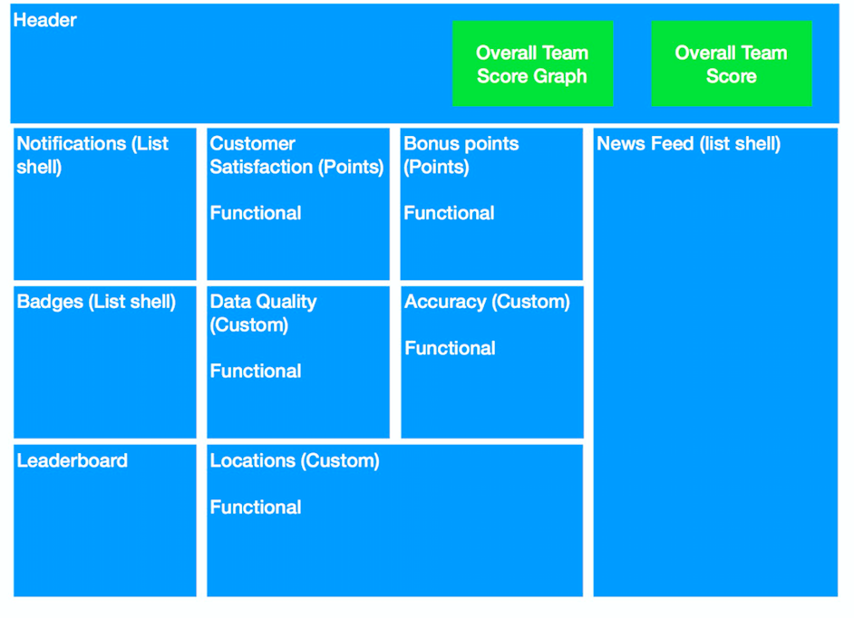 

#### Step 3 - Data

I'll run through the above and generate the dummy data so that I can really understand how the structure is going to work before I dive in.

#### Step 4 - Tooling

Tooling. I'm using a boilerplate for another app I used, which in turn was I think the basis for an online tutorial I took. As a result a couple of the plugins are a little out of date, but will be fine for now. Need to tweak a couple of webpack settings to accomodate sass and images, but not too much trouble - we're up and running!

Tools:
Webpack
React
Redux
Babel
Sass
Lots more beyond

#### Step 4 - Front end libraries

Research front end libraries such as Material UI and Bootstrap for React.

Material UI looks really neat with lots of things that are somewhat similar to the design which seems to be material in influence, if not completely. Bootstrap might be easier as I'm used to working with that a little more.

[Material UI](http://www.material-ui.com/#/)

[Bootstrap](https://react-bootstrap.github.io/)

I'll also need a chart generator. The one over at [Recharts](http://recharts.org/#/en-US) looks reallly nice.

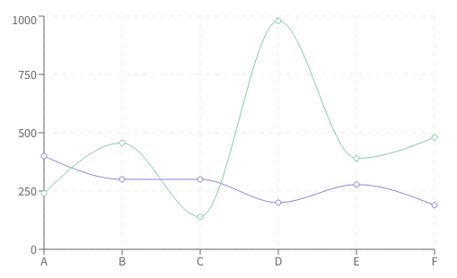

#### Step 5

Wrestling with  Material UI took up a lot of time today and without much luck. Tried to use the Material UI tabs for the main graph on the header, and the circular progress bar. Neither were very flexible - at times I wanted to force change the colour and it simply wasn't possible. Suppose it's to be expected in a V1.0 Beta but I'd hoped for more. 

I opened up bootstrap to see if there was anything there that might be useful but again found it not so flexible and hard to cusomise.

#### Step 5

Started drafting up the header without any large libraries, using a stand alone npm package for the circular progress and a custom Rechart for the header. Took me a lot longer than I'dve hoped but think it's looking ok. Will save the polish if I have time at the end. I started on the header before everything else so I can understand better my approach with every other tile.

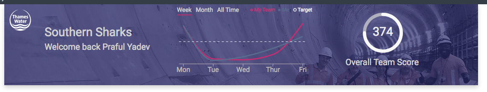

## Day 2

#### Step 6 - Tile Layout

Now I've taken on the header I'll look into the other components. Not 100% sure the best way of having all of the tiles slotting neatly next to each other, which I think is going to be key for looking on a desktop, but also how that then transfers to a mobile device.

I've dived into the libraries again looking for a neat grid/layout framework/library. Bootstrap might be a good idea but I'm after something lightweight and neat. I'm liking the look of [Elemental](http://elemental-ui.com/grid). It's grid looks neat for all of these bits and bobs which might get quite unweildy.

I'm going to give this a go and will end up trying to recreate the wireframe on the site. Then once I'm happy with the responsiveness etc I'll look to complete the implementation for the individual elements.

After a quick play and the need to update my webpack bundler to do LESS too, which didn't fix straight away. That coupled with some of my styling going funky, I'm looking for something even lighter that only does grid.

Looks like Bootstrap will do exactly what I need after all.

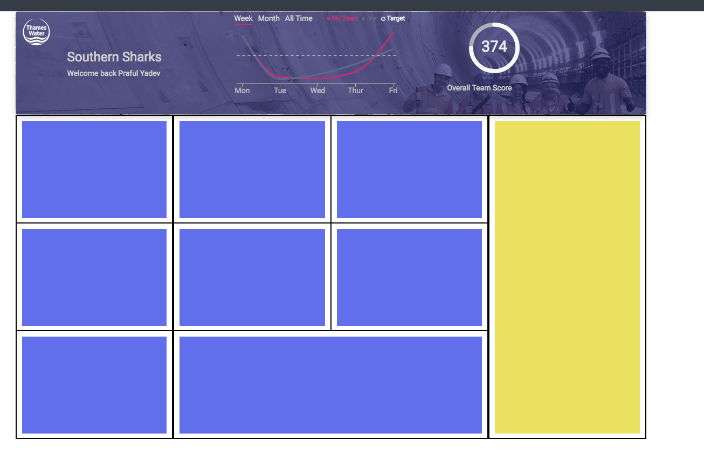

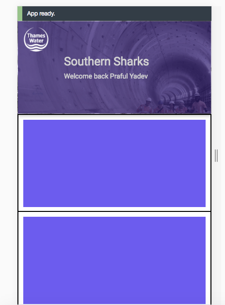

#### Step 7 - Circular Icon/Focus Tile

Two exactly the same, and one other that is very similar. Think it would be good to polish them off. Mainly CSS based to get the look and feel the same as the example, no real technical challenges that haven't already been addressed. It's worth designing a generic element for both and then pass arguments/props as needed.

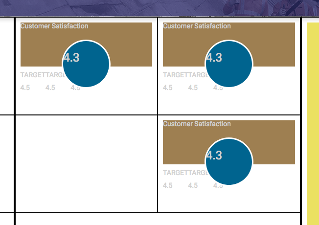

## Day 3

Getting back to the process after Christmas - did a few tweaks here and there over the period but nothing too grand and worth denoting as a step.

* Passed in props to the individual tiles so they could be dynamically cusomised
* Started on the 'wideBoy' tile (4 circles)
* Started on the 'graph' tile

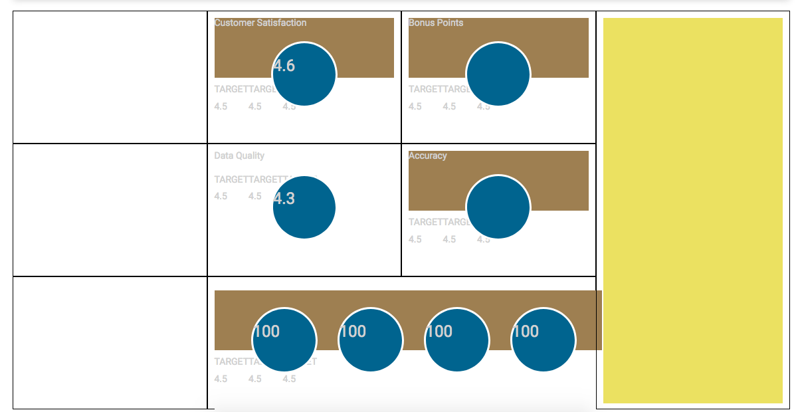

#### Step 8

I'm going to jump back into this wide tile that I was fiddling with over christmas - it's height doesn't change, which needs to - though only the white space below. The image/title div should stay the same to retain the current aesthetic. The circle's titles also need to be grouped with the circles. There also seems to be a padding/margin issue when fitting in with the rest of the grid. Once these CSS tweaks are addressed will set up the props so that the component can be dynamically populated with data - will decide at the time as to whether the titles for the circles will also be able to be dynamically changed.

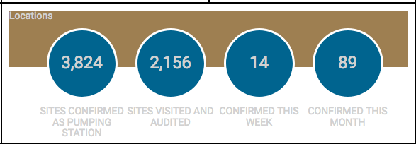

See here the progress made. Props now dynamically render the data points, including tile title and data titles. Also added function which places commas with the big numbers. Tempted to make that a site-wide amendment but it will do for now.

Finding it tricky to get the div to stay in the center with all circles evenly spaced from each other. 

After some fixing, got it together:

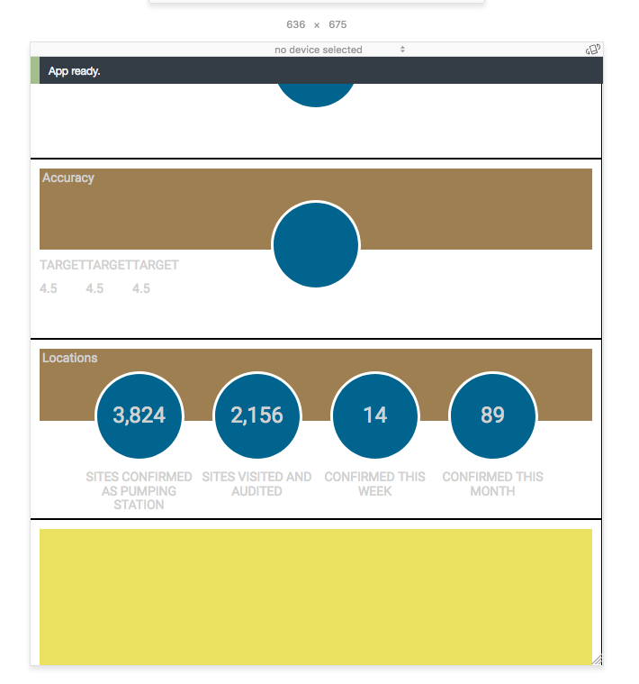

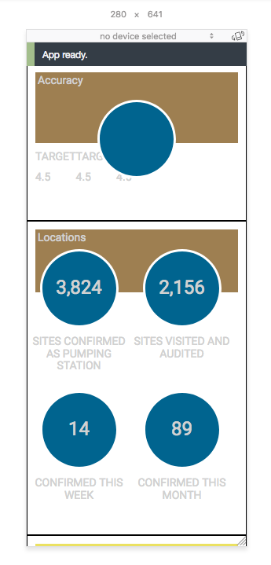

#### Step 9 - Indicators

Need to put the upticks, downticks and neutral characters for all of the points. Not entirely sure of the best way to do this - do I create a component that does it for everything? I think probably.

Will create both a percentage component, and an indicator component that I can use. The percentage component will accept arguments of timeframe - week or month, and then the array that needs to be processed. The indicator will simply return a positive arrow if the input is positive, and a negative one if the opposite. In event of a zero or other critter it'll respond with a flat line. 

The styling will be dynamically processed for the elements accordingly.

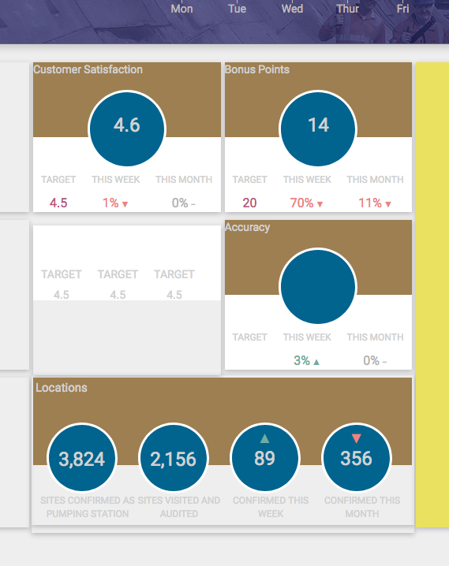

Poof! There we are - and just a touch of styling on top to see how far off it all is.

#### Step 10 Notifications and Badges

Going to start by blocking out the basic CSS, and then look to separating off into components if that becomes relevant.

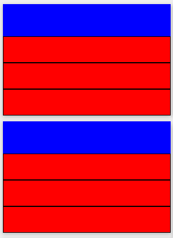

Probably time for a quick update as I come out of the wormhole. Positioning is a bit skee-wiff but got the components rendering from the data as they should. There is an action component which takes several different arguments, rendering the appropriate layout as seen below (excusing the current positioning issues).

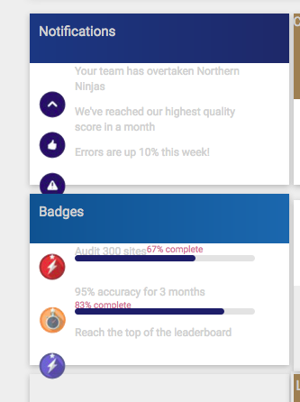

## Day 4

Not perfect, but bit better now. Good enough to move on and come back at the end. Will need to add new notifications icon, and the option to 'view all'. 

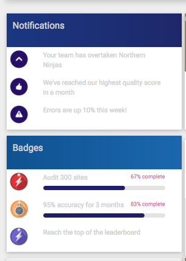

#### Step 12 Accuracy

Accuracy tile is laid out differently to the other 'circle' tiles. I either make a separate component for it, or keep the current 'circle' component, but have it change if Accuracy prop is given. I'll go for the latter now, but might need to be changed in future.

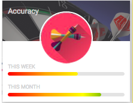

Happy with this for now but two big flaws:

- Gradients loop when tile is expanded
- No progress markers on the bar charts

I probably need to build my own component here - I've lifted these progress bar components from NPM. Can come back to these if have time at the end.

#### Step 13 Images

Want to see how far off the styling is by adding images and gradients where relevant. Added a transparent div over the images to mimic that faded effect.

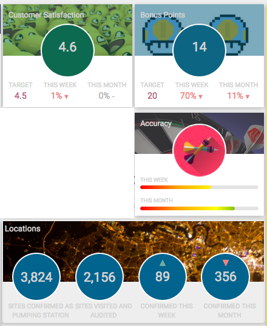

#### Step 14 Graph Tile

This brings together a lot of elements that have been used in the header, so should be pretty straightforward. The rising trend line might be the only issue. Here goes...

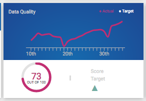

## Day 5

Need to complete the graph tile, the news feed and the leaderboard. Main thing is to also make the header responsive as the UL's don't respond when the dimension changes. Think this would be the best place to start, this way can be sure that all elements are responsive moving forward and can address unexpected issues when they arise. Next step after that is to finish up the graph tile. 